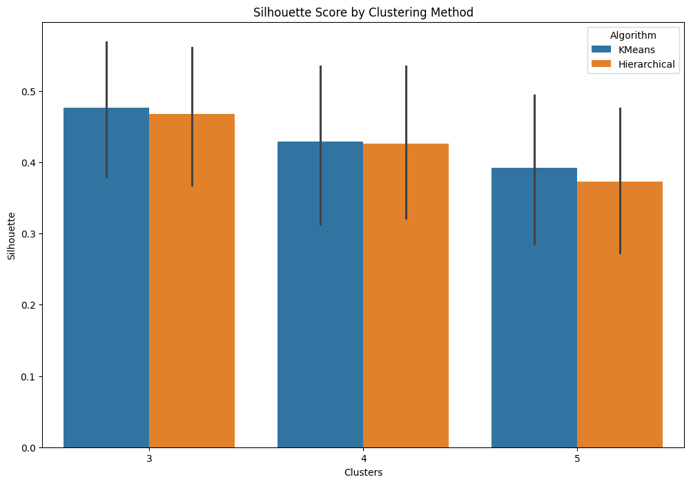

# Wine Dataset Clustering Analysis

This repository explores clustering techniques applied to the Wine dataset from the UCI Machine Learning Repository. The aim is to group similar wines based on chemical properties by experimenting with different preprocessing, dimensionality reduction, and clustering algorithms, and to evaluate their performance across various metrics.

## Table of Contents

- [Project Overview](#project-overview)
- [Dataset](#dataset)
- [Setup and Installation](#setup-and-installation)
- [Project Structure](#project-structure)
- [Methodology](#methodology)
- [Results](#results)
- [Conclusions](#conclusions)
- [License](#license)

## Project Overview

The goal of this project is to:

- Apply clustering algorithms on the Wine dataset.
- Experiment with scaling techniques and Principal Component Analysis (PCA).
- Evaluate clustering performance using Silhouette Score, Calinski-Harabasz Score, and Davies-Bouldin Score.

This analysis provides insights into unsupervised learning techniques and can serve as a template for clustering analysis on similar datasets.

## Dataset

The Wine dataset, available from the UCI Machine Learning Repository, consists of 13 chemical properties of wine samples from three different cultivars. The target variable `Class` is omitted for clustering analysis, treating it as an unsupervised learning task.

### Features:
- **Attributes:** 
  - Alcohol, Malic_acid, Ash, Alcalinity, Magnesium, Phenols, Flavanoids, Nonflavanoid, Proanthocyanins, Color_intensity, Hue, OD280/OD315, Proline.
- **Target:** Class (omitted for clustering).

## Setup and Installation

1. Clone this repository:
   ```bash
   git clone https://github.com/shaurya-bhatia-sb/Wine-Dataset-Clustering-Analysis.git
   ```

2. Navigate into the project directory:
   ```bash
   cd Wine-Dataset-Clustering-Analysis
   ```

3. Install the required dependencies:
   ```bash
   pip install -r requirements.txt
   ```

## Project Structure

- `wine_clustering.py`: Main script with functions for data loading, scaling, PCA, clustering, and evaluation.
- `requirements.txt`: List of required Python packages.
- `README.md`: Project documentation.

## Methodology

### 1. Data Preprocessing
- **Scaling:** Applied three methods—no scaling, normalization (Min-Max scaling), and standardization (Z-score).
- **Dimensionality Reduction:** Used PCA to reduce data to two principal components, simplifying data structure for visualization and improving clustering performance.

### 2. Clustering Algorithms
- **KMeans Clustering**
- **Agglomerative Clustering (Hierarchical)**

Each algorithm was evaluated for different numbers of clusters (3, 4, and 5) to determine the optimal grouping.

### 3. Evaluation Metrics
- **Silhouette Score:** Measures cohesion and separation (higher is better).
- **Calinski-Harabasz Score:** Evaluates the dispersion of clusters (higher is better).
- **Davies-Bouldin Score:** Assesses compactness and separation (lower is better).

## Results

- **Scaling Impact:** Standardization consistently improved clustering quality.
- **PCA Effect:** Dimensionality reduction through PCA led to more defined clusters, especially for KMeans.
- **Best Configuration:** KMeans with 3 clusters and standardized data yielded the highest performance in Silhouette and Calinski-Harabasz scores.

### Visualization
A bar plot visualizes Silhouette Scores across configurations, comparing algorithms and cluster counts. The visualizations provide insights into the clustering quality and help determine the most effective configurations.



## Conclusions

- **Optimal Setup:** Standardized data with PCA and KMeans clustering using 3 clusters performed the best.
- **Scaling:** Significantly affects clustering performance, with standardization providing the best results.
- **PCA:** Reduces dimensionality effectively, making clustering algorithms more accurate and computationally efficient.

This analysis demonstrates how data preprocessing, PCA, and different clustering algorithms can influence clustering results on high-dimensional datasets.

## License

This project is licensed under the MIT License.


